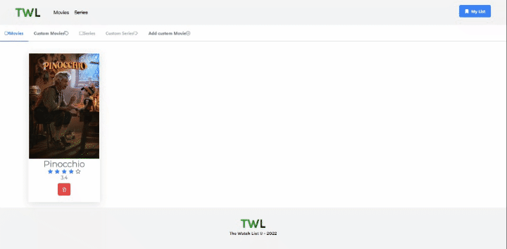

# MoviesList

### Project of an e-commerce to practice knowledge in Angular and TS.

## 💻 Stack

  
             
            
                                 

 ## 📈 Future Improvements
 - [ ] Search Bar

## 📷 Images 
### Home Page

### Home Page (Filter Movies)

### Movie Detail

### Add Movie to My List

### Remove Movie to My List

---
## How to run this project

This project was generated with [Angular CLI](https://github.com/angular/angular-cli) version 14.1.2.

Run `json-server --watch db.json` to start a fake api REST.
For more information please visit [JSON-SERVER](https://www.npmjs.com/package/json-server) 

Run `ng serve` for a dev server. Navigate to `http://localhost:4200/`. The application will automatically reload if you change any of the source files.
## Further help

To get more help on the Angular CLI use `ng help` or go check out the [Angular CLI Overview and Command Reference](https://angular.io/cli) page.
